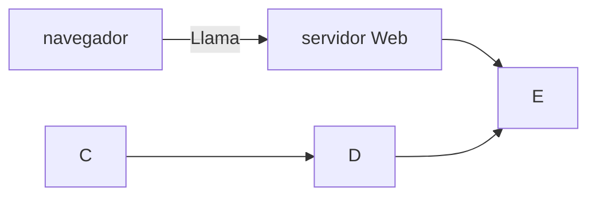

+++
title = 'Markdown'
date = 2024-10-04T13:27:06+02:00
draft = false
weight = 20
+++

## Edicion basica

### titulos
Para establecer los titulos usare la siguiente sintaxis

```makefile
# titulo1
## titulo2
### titulo3
#### titulo4
```

y se verá

---

# titulo1
## titulo2
### titulo3
#### titulo4
---

### negrita y formato

Para ver el texto en negrita escribo

```markdown
**texto en negrita** texto normal
```
y se vera 

**Texto en negrita** texto normal



PHP es yn lenguaje interesante y bonito 
accede a la web 

